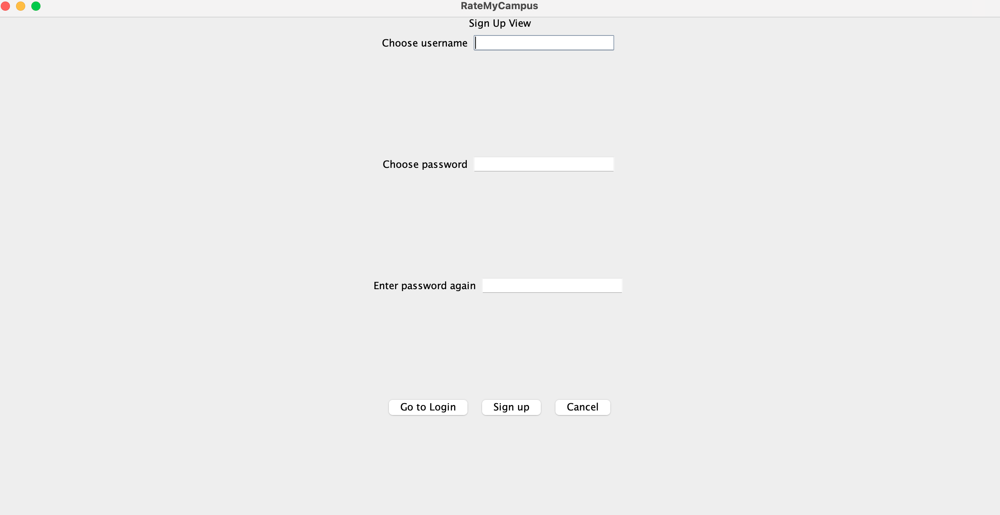
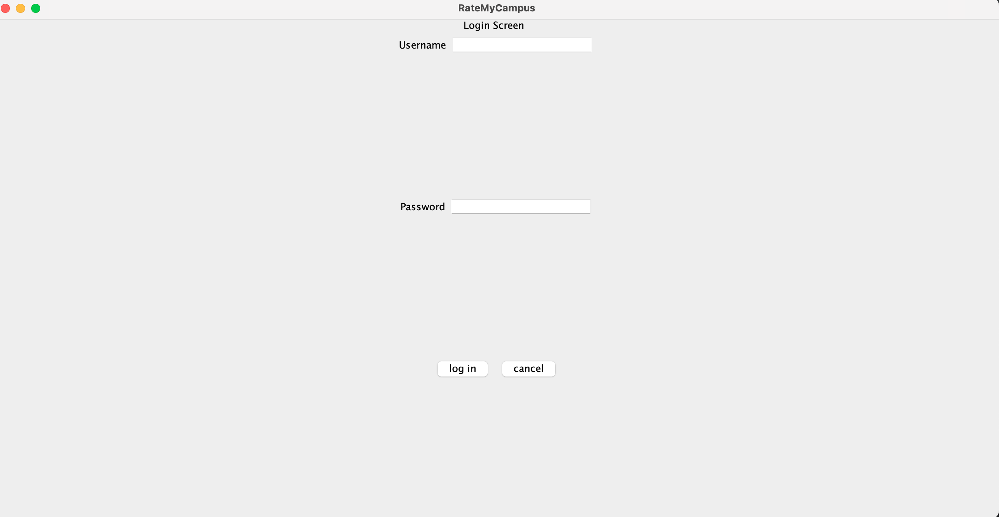
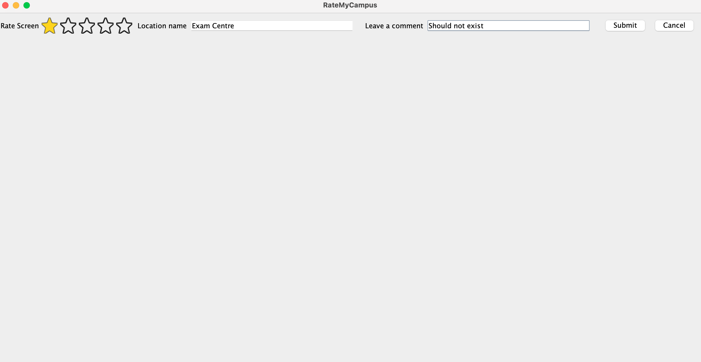
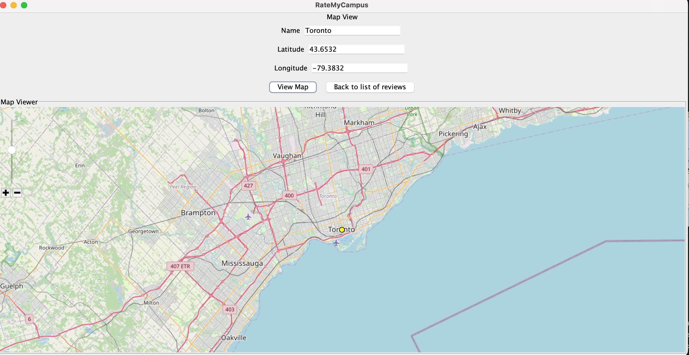

# RateMyCampus
## Contributors:
**Authors**: [Minghao Sun](https://github.com/TNDLight)
* [Leandro Hamaguchi](https://github.com/LeandroHamaguchi)
* [Tianyu Luo](https://github.com/stevenluo624)
* [Karan Singh](https://github.com/codymavok)
* [Minghao Sun](https://github.com/TNDLight)
* [David Wang](https://github.com/David1425)

## Project Summary
This project is a Java Swing-based application allowing users to creat acouunts, post reviews, and rate various University or Toronto places such as library, food truck, building. Users can also view the places on an interactive map, they can view, reply or like other people's review on each place, plus user can build personal profiles with unque bios. 

The application aims to provide a collaborative and engaging platform for students, staff, and vistors to share and explore perspectives about campus spaces.

The application addresses the lack of an integrated platform for University of Toronto students, staffm and vistors to share their experiences and opinions about campus buildings. It helps:
1. **New Students**: Explore different places on campus based on peer reviews.
2. **Campus Visitors**: Find well-rated places for visit, dining or recreation.
3. **University Staff**: Gain insights into user experiences and feedback to imporve facitlities. 

## Table of Contents
- [Project Overview](#ratemycampus)
- [Project Summary](#project-summary)
- [Features](#features)
- [Installation Instructions](#installation-instructions)
- [Usage](#usage)
- [License](#license)
- [Feedback and Contributions](#feedback-and-contributions)

## Features
* User registration and authentication system.

* Profile creation with unique bios.
* Post, view and rate reviews of University of Toronto places.

* Interactive map integration to explore various places location.

* Ability to like and reply to reviews.

## Installation Instructions

## Usage

## License

## Feedback and Contributions

