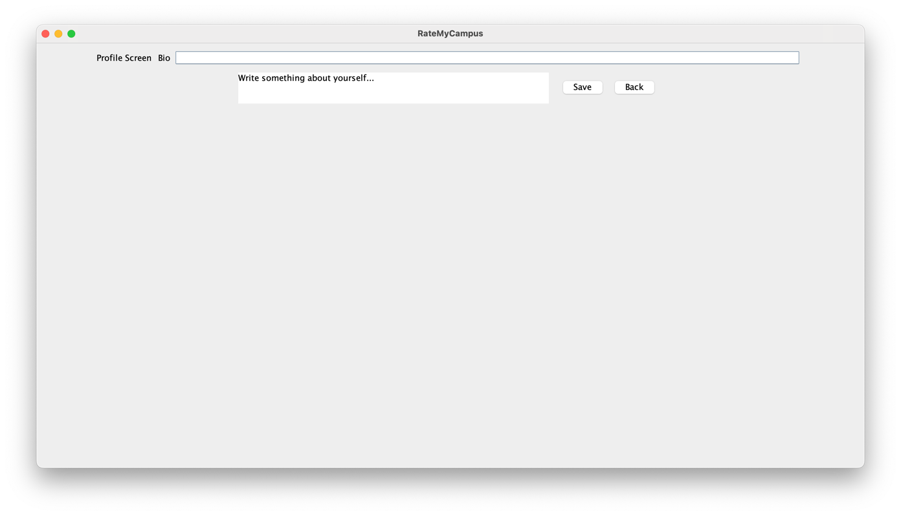

# RateMyCampus
## 🏆 Contributors:
| Name                     | GitHub Username          |
|---------------------------|--------------------------|
| **Leandro Hamaguchi**     | [LeandroHamaguchi](https://github.com/LeandroHamaguchi)|
| **Tianyu Luo**            | [stevenluo624](https://github.com/stevenluo624)        |
| **Karan Singh**           | [codymavok](https://github.com/codymavok)              |
| **Minghao Sun**           | [TNDLight](https://github.com/TNDLight)                |
| **David Wang**            | [david1425](https://github.com/David1425)              |

## 📊 Project Summary
This project is a Java Swing-based application allowing users to create accounts, post reviews, and rate various University or Toronto places such as library, food truck, building. Users can also view the places on an interactive map, they can view, reply or like other people's review on each place, plus user can build personal profiles with unque bios. 

The application aims to provide a collaborative and engaging platform for students, staff, and vistors to share and explore perspectives about campus spaces.

The application addresses the lack of an integrated platform for University of Toronto students, staffm and vistors to share their experiences and opinions about campus buildings. It helps:
1. **New Students**: Explore different places on campus based on peer reviews.
2. **Campus Visitors**: Find well-rated places for visit, dining or recreation.
3. **University Staff**: Gain insights into user experiences and feedback to imporve facitlities. 


## 📑 Table of Contents
- [Project Overview](#ratemycampus)
- [Project Summary](#-project-summary)
- [Features](#-features)
- [Installation Instructions](#%EF%B8%8F-installation-instructions)
- [Usage](#-usage)
- [License](#-license)
- [Feedback and Contributions](#-feedback-and-contributions)


## ✨ Features
* Profile creation with unique bios.

* Post, view and rate reviews of University of Toronto places.

* Interactive map integration to explore various places location.

* Ability to like reviews.

## 🛠️ Installation Instructions
Before you install the package, make sure the following are installed on your system as an environment.
   - [Java Development Kit (JDK): Version 11 or higher](https://www.oracle.com/java/technologies/downloads/#java11?er=221886)
   - [Apache Maven: Latest version](https://maven.apache.org/download.cgi)
   - [Git](https://git-scm.com/)
   - [IDE: IntelliJ IDEA](https://www.jetbrains.com/idea/download/?section=mac)

The Project is compatible through all Operating System, and has been tested on WindowsOS and MacOS. 
1. Clone the repository (or make sure the .idea, pom.xml and src folder are downloaded on your laptop).
   ```
   git clone https://github.com/stevenluo624/RateMyCampus.git
   ```
2. Check the java version (if your are building from the terminal).
   ```
   java -version
   ```
   Or check java version on your IDE (i.e. intellij), the project is built with corretto-17.
3. Open your IDE and import the project
   In your IDE (i.e. Intellij)
   - Go to File > Open and select the project directory.
   - Open it as a maven project.
4. Build the Project
   - Open the terminal and navigate to the project
     ```
     cd RateMyCampus
     ```
   - and execute the following command
     ```
     mvn clean install
     ```
5. Run the main application MainRateMyCampusApp.java in directory src/main/java/app
  - Right click the MainRateMyCampusApp.java and run
  - Or if you are building from the terminal, use the following command line
    ```
    javac src/main/java/app/MainRateMyCampusApp.java
    ```
6. Common Issues:
   - Maven Issue: Reload the maven project (i.e. pom.xml) and build the RateMyCampus application.
   - 
   - use ```mvn clean install``` to install missing dependencies.
   - If the IDE encountered an issue, make sure the correct version of Java is installed or check the java version in project structure (i.e. <kbd>command</kbd> <kbd>;</kbd> to open project structure and check the java version. 
   - 

## 📖 Usage
1. Signup for an account (if you have an existing account jump to login)

2. Login with your account

3. Check the reviews posted
   
4. Make your own review by clicking add your review button

5. Click on the stars to add your review (from a scale of 1-5) and add your comment. Once you finish your review click submit
6. Or you can check our the location of the place being reviewed by clicking view map button, you zoom in to see the exact location of the place.

7. Click the View Profile button in List Review to create your own profile.



## 📜 License
This project is licensed under the MIT License. See the [LICENSE.md](LICENSE) file for details.

## 💻 Feedback and Contributions
### Feedbacks
We welcome feedback and suggestions! Please open an issue on GitHub or contact us via [Google Form](https://docs.google.com/forms/d/e/1FAIpQLSfLvapOTcbBCixbNcKGnz9T7zNVomn7YI8HXXTcTsjRQ9pMzg/viewform?usp=sf_link).

People who wants to provide feedback must provide their name and email address in case we need to contact you. Valid feedback must contain a clear description of either a clear description of the issue and what is expected to be fixed or a detailed elaboration of the feature we can add for improvement and a short description of your propose solution. 

### Contributions
1. Fork the repository.
2. Create a new branch.
   ```
   git checkout -b feature-branch
   ```
3. Make your changes.
4. Commit your changes
    ```
   git commit -m 'Add some feature'
    ```
5. Push to the branch
   ```
   git push origin feature-branch
   ```
6. Open a pull request.

